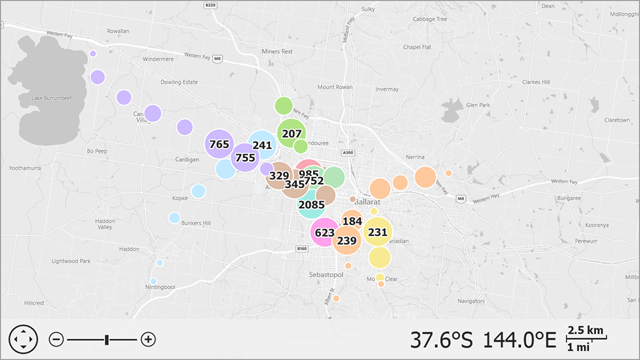

<!-- default badges list -->

<!-- default badges end -->

# Map Control for WinForms - How to Use Clusterers to Aggregate Vector Items

This example demonstrates how to cluster vector items in the Map Control.

Note that you can only cluster map items that implement the `IClusterable` interface (for example, [MapDot](https://docs.devexpress.com/WindowsForms/DevExpress.XtraMap.MapDot?p=netframework), [MapCallout](https://docs.devexpress.com/WindowsForms/DevExpress.XtraMap.MapCallout?p=netframework), [MapCustomElement](https://docs.devexpress.com/WindowsForms/DevExpress.XtraMap.MapCustomElement?p=netframework) and [MapPushpin](https://docs.devexpress.com/WindowsForms/DevExpress.XtraMap.MapPushpin?p=netframework)).

Follow the steps below to cluster map items:

1. Assign an object of a class that implements the [IClusterer](https://docs.devexpress.com/WindowsForms/DevExpress.XtraMap.IClusterer?p=netframework)
interface to the [MapDataAdapterBase.Clusterer](https://docs.devexpress.com/WindowsForms/DevExpress.XtraMap.MapDataAdapterBase.Clusterer?p=netframework) property. 

2. To group the items based on an attribute, assign an [AttributeGroupProvider](https://docs.devexpress.com/WindowsForms/DevExpress.XtraMap.AttributeGroupProvider?p=netframework) object to the [MapClustererBase.GroupProvider](https://docs.devexpress.com/WindowsForms/DevExpress.XtraMap.MapClustererBase.GroupProvider?p=netframework) property. Set the [AttributeGroupProvider.AttributeName](https://docs.devexpress.com/WindowsForms/DevExpress.XtraMap.AttributeGroupProvider.AttributeName?p=netframework) property to the item attribute name that should be used to cluster items. After that, only items with an equal attribute value are grouped into the same cluster.

3. Design a class that implements the [IClusterItemFactory](https://docs.devexpress.com/WindowsForms/DevExpress.XtraMap.IClusterItemFactory?p=netframework) interface to customize the appearance of clusters. Then, call the [MapClustererBase.SetClusterItemFactory](https://docs.devexpress.com/WindowsForms/DevExpress.XtraMap.MapClustererBase.SetClusterItemFactory(DevExpress.XtraMap.IClusterItemFactory)?p=netframework) method with an object of the class to assign the required factory object to the clusterer.

<!-- default file list -->
## Files to Look At
* [Form1.cs](./CS/ClustererSample/Form1.cs) (VB: [Form1.vb](./VB/ClustererSample/Form1.vb))
<!-- default file list end -->

## Documentation

- [Map Item Clusters](https://docs.devexpress.com/WindowsForms/114673/controls-and-libraries/map-control/vector-data/clusterers?p=netframework)

## More Examples

- [How to Implement a Custom Clusterer](https://github.com/DevExpress-Examples/how-to-implement-a-custom-clusterer-t312237)
